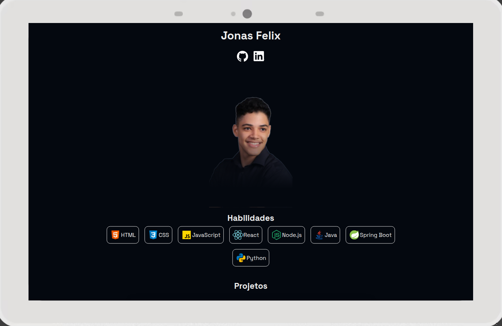
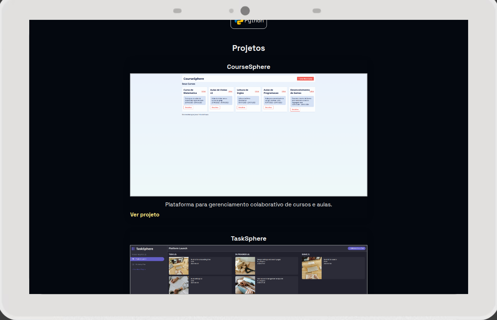
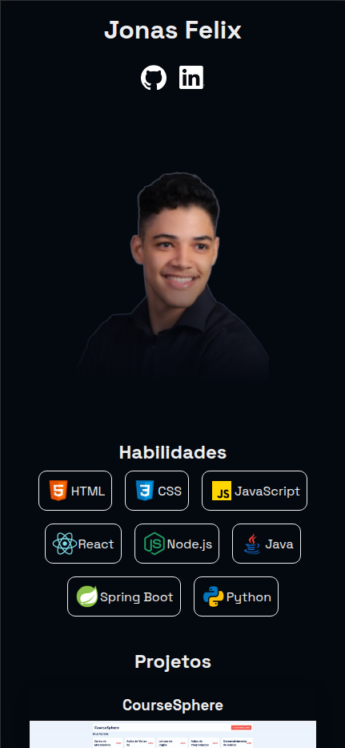
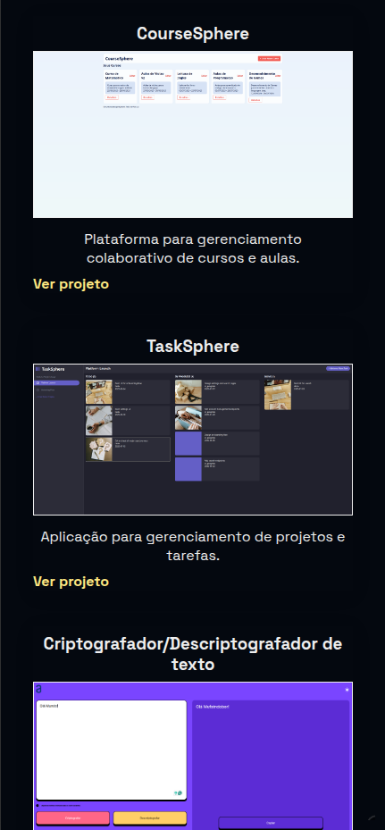

# Jonas Felix - Developer Portfolio 🚀

Welcome to the source code for my personal developer portfolio website!  
👉 You can view it live here: [https://jonasfelix.netlify.app/](https://jonasfelix.netlify.app/)  
This project showcases some of my skills, and projects as a frontend/backend developer.

---

## 📸 Preview

|                                           |                                           |
| ----------------------------------------- | ----------------------------------------- |
|  |  |
|   |   |

## ✨ Features

-   Fully responsive and modern design
-   Smooth scrolling and animations
-   Project showcase with links
-   Contact form or contact details
-   Fast performance and SEO-friendly

## 🛠️ Technologies Used

-   **HTML5**
-   **CSS3**
-   **JavaScript**
-   **Netlify**

## 📬 Contact

Have feedback or want to connect?

-   Portfolio: [https://jonasfelix.netlify.app/](https://jonasfelix.netlify.app/)
-   LinkedIn: [https://www.linkedin.com/in/jonas-felix-dev/](https://www.linkedin.com/in/jonas-felix-dev/)
-   Email: [jonasfelixdesouza21@gmail.com](jonasfelixdesouza21@gmail.com)
